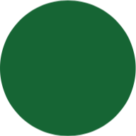

<div id="top"></div>

<!-- PROJECT SHIELDS -->
[![Contributors][contributors-shield]][contributors-url]
[![Forks][forks-shield]][forks-url]
[![Stargazers][stars-shield]][stars-url]
[![Issues][issues-shield]][issues-url]
[![MIT License][license-shield]][license-url]


<!-- PROJECT LOGO -->
<br />
<div align="center">
  <a href="https://github.com/near-everything/collect">
    
  </a>

<h2 align="center">collect</h3>

  <p align="center">
    A tool for adding items to the inventory of everything.
    <br />
    <!-- <a href="https://documentation.everything.dev"><strong>Explore the docs »</strong></a> -->
    <!-- <br /> -->
    <br />
    <a href="https://collect.everything.dev">Use App</a>
    ·
    <a href="https://github.com/near-everything/collect/issues">Report Bug</a>
    ·
    <a href="https://github.com/near-everything/collect/issues">Request Feature</a>
  </p>
</div>


<!-- TABLE OF CONTENTS -->
<details>
  <summary>Table of Contents</summary>
  <ol>
    <li>
      <a href="#about-the-project">About The Project</a>
      <ul>
        <li><a href="#built-with">Built With</a></li>
      </ul>
    </li>
    <li>
      <a href="#getting-started">Getting Started</a>
      <ul>
        <li><a href="#prerequisites">Prerequisites</a></li>
        <li><a href="#installation">Installation</a></li>
      </ul>
    </li>
    <li><a href="#usage">Usage</a></li>
    <li><a href="#roadmap">Roadmap</a></li>
    <li><a href="#contributing">Contributing</a></li>
    <li><a href="#license">License</a></li>
    <li><a href="#contact">Contact</a></li>
    <li><a href="#acknowledgments">Acknowledgments</a></li>
  </ol>
</details>


<!-- ABOUT THE PROJECT -->
## About The Project

<!-- [![Product Name Screen Shot][product-screenshot]](https://example.com) -->
collect is one of several applications to aid in the creation of the [inventory of everything](https://everything.dev).


<p align="right">(<a href="#top">back to top</a>)</p>


### Built With

* [![React][React.js]][React-url]

<p align="right">(<a href="#top">back to top</a>)</p>


<!-- GETTING STARTED -->
## Getting Started

### Prerequisites

* npm
  ```sh
  npm install npm@latest -g
  ```

### Installation

1. Clone the repo
   ```sh
   git clone https://github.com/near-everything/collect.git
   ```
2. Install NPM packages
   ```sh
   npm install
   ```

<p align="right">(<a href="#top">back to top</a>)</p>


<!-- USAGE EXAMPLES -->
## Usage

Make sure you have the [everything-api](https://github.com/near-everything/api) running locally.

Run the app in development mode:

```sh
 npm start
 ```

Open [http://localhost:3000](http://localhost:3000) to view it in the browser.

The page will reload if you make edits.<br />
You will also see any lint errors in the console.


<br/>
Launch the test runner in the interactive watch mode:

```sh
  npm run test
  ```

See the section about [running tests](https://facebook.github.io/create-react-app/docs/running-tests) for more information.


_For more examples, please refer to the [Documentation](https://example.com)_

<p align="right">(<a href="#top">back to top</a>)</p>


<!-- ROADMAP -->
## Roadmap

- [ ] Create SDK
- [ ] TBD...

See the [open issues](https://github.com/near-everything/collect/issues) for a full list of proposed features (and known issues).

<p align="right">(<a href="#top">back to top</a>)</p>


<!-- CONTRIBUTING -->
## Contributing

Contributions are what make the open source community such an amazing place to learn, inspire, and create. Any contributions you make are **greatly appreciated**.

If you have a suggestion that would make this better, please fork the repo and create a pull request. You can also simply open an issue with the tag "enhancement".
Don't forget to give the project a star! Thanks again!

1. Fork the Project
2. Create your Feature Branch (`git checkout -b feature/AmazingFeature`)
3. Commit your Changes (`git commit -m 'Add some AmazingFeature'`)
4. Push to the Branch (`git push origin feature/AmazingFeature`)
5. Open a Pull Request

<p align="right">(<a href="#top">back to top</a>)</p>


<!-- LICENSE -->
## License

Distributed under the MIT License. See `LICENSE.txt` for more information.

<p align="right">(<a href="#top">back to top</a>)</p>


<!-- CONTACT -->
## Contact

Elliot Braem - elliot@everything.dev


<p align="right">(<a href="#top">back to top</a>)</p>


<!-- ACKNOWLEDGMENTS -->
## Acknowledgments

* This project was bootstrapped with [Create React App](https://github.com/facebook/create-react-app), using the [Redux](https://redux.js.org/) and [Redux Toolkit](https://redux-toolkit.js.org/) template.
* The structure and styles of this project were adapted from [Windmill React UI](https://github.com/estevanmaito/windmill-react-ui).

<p align="right">(<a href="#top">back to top</a>)</p>


<!-- MARKDOWN LINKS & IMAGES -->
<!-- https://www.markdownguide.org/basic-syntax/#reference-style-links -->
[contributors-shield]: https://img.shields.io/github/contributors/near-everything/collect.svg?style=for-the-badge
[contributors-url]: https://github.com/near-everything/collect/graphs/contributors
[forks-shield]: https://img.shields.io/github/forks/near-everything/collect.svg?style=for-the-badge
[forks-url]: https://github.com/near-everything/collect/network/members
[stars-shield]: https://img.shields.io/github/stars/near-everything/collect.svg?style=for-the-badge
[stars-url]: https://github.com/near-everything/collect/stargazers
[issues-shield]: https://img.shields.io/github/issues/near-everything/collect.svg?style=for-the-badge
[issues-url]: https://github.com/near-everything/collect/issues
[license-shield]: https://img.shields.io/github/license/near-everything/collect.svg?style=for-the-badge
[license-url]: https://github.com/near-everything/collect/blob/master/LICENSE.txt
[product-screenshot]: images/screenshot.png
[React.js]: https://img.shields.io/badge/React-20232A?style=for-the-badge&logo=react&logoColor=61DAFB
[React-url]: https://reactjs.org/